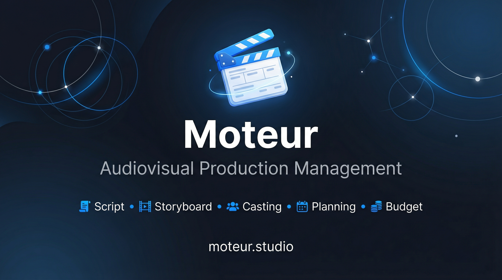

# 🎬 Moteur

**L'application tout-en-un pour écrire et produire vos films.**

> Le seul outil où l'écriture et la production forment un continuum : du premier mot du scénario à la feuille de service du tournage.

---

## ✨ Fonctionnalités

### 📝 Écriture
- **Scénario** — Éditeur professionnel, formatage automatique (action, dialogue, didascalie…)
- **Import PDF / FDX** — Récupérez vos scénarios existants
- **Séquencier** — Vue d'ensemble de toutes vos scènes
- **Storyboard** — Éditeur de dessin intégré
- **MoodBoard** — Planches d'inspiration avec générateur de palettes

### 🎭 Casting & décors
- **Personnages** — Fiches liées au scénario
- **Comédiens & équipe technique** — Profils détaillés, organigramme par département
- **Dépouillement** — Analyse des besoins par scène

### 📅 Organisation
- **Planning** — Calendrier de tournage interactif, plan de travail au modèle AFAR
- **Feuilles de service** — Génération automatique avec météo, équipe B le même jour, heures supplémentaires
- **Budget** — Mode simple ou avancé
- **Contrats** — CDDU, droit à l'image, prestation, bénévolat (orientés droit français, à faire valider juridiquement)

### 🌍 Communauté
- **Univers** — Annuaire géolocalisé de professionnels et de structures
- **Profils publics** — Comédiens, techniciens, associations, entreprises
- **Collaboration temps réel** — Travail en équipe sur un même projet

---

## 🚀 Démo

👉 **[moteur.studio](https://moteur.studio)**

---

## 🛠️ Technologies

- **Frontend** : HTML5, CSS3, JavaScript (vanilla, single-page app)
- **Backend** : [Supabase](https://supabase.com) (Auth, Database, Storage)
- **Cartes** : [Leaflet](https://leafletjs.com) + OpenStreetMap
- **Hébergement** : GitHub Pages

---

## 📝 Suivi du projet

Le reste à faire, les règles du projet et le journal de chaque version sont
dans [SUIVI.md](SUIVI.md). Le code se modifie dans `src/parts/` (voir
[src/README.md](src/README.md)) : `index.html` est généré.

[Voir l'historique des modifications →](https://github.com/gadmy/moteur/commits/main)

---

## 📄 Licence

Code propriétaire, tous droits réservés. Toute reproduction ou réutilisation,
totale ou partielle, est interdite sans autorisation écrite. Voir le fichier
[LICENSE](LICENSE).

---

## 👨‍💻 Auteur

**Guillaume de Mauroy** — [moteur.studio](https://moteur.studio)

---

  <strong>🎬 Moteur</strong> — Fait avec ❤️ pour les cinéastes

